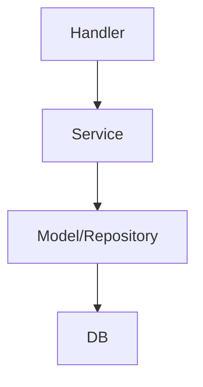

# 召回技术方案

## 一、目标与背景

本技术方案旨在工程化实现“缺货点位召回”功能。即自动筛选出当前处于缺货状态的点位，为后续补货调度和运营决策提供数据支撑。方案采用Golang开发，架构上将DAO与Model整合为Model（Repository模式），简化结构，提升开发效率和可维护性。

## 二、核心业务与缺货定义

- 缺货点位：指SKU数量小于6，或当前库存小于等于m（m为可配置参数）的点位。
- 业务目标：高效、准确地召回所有缺货点位，并为其补充必要的业务属性。

## 三、架构设计（Model/Repository模式）

### 1. 架构原则
- 采用Model/Repository模式，将数据结构定义与数据访问方法合并。
- 每个Model结构体即为业务数据模型，同时包含相关数据访问方法。
- Service层仅做业务编排，Handler层负责接口暴露。

### 2. 架构示意



- Model/Repository：定义业务结构体及其数据访问方法，直接与数据库交互。
- Service：调用Model/Repository方法，进行业务逻辑处理。
- Handler：提供API接口，接收请求并返回结果。

## 四、SQL优化：引入CTE提升可读性

### 优化前SQL（示例）
```sql
SELECT a.id AS point_id
FROM smart_cooker_sg.point a
LEFT JOIN (
    SELECT point_id, MIN(date(create_time)) AS min_dt
    FROM smart_cooker_sg.order
    WHERE create_time >= DATE_SUB(CURRENT_DATE, INTERVAL 90 DAY)
      AND status IN (7, 8) AND order_mode = 1
    GROUP BY point_id
) b ON a.id = b.point_id
WHERE b.point_id IS NULL OR DATEDIFF(CURRENT_DATE, b.min_dt) <= 7
```

### 优化后SQL（CTE方案）
```sql
WITH recent_orders AS (
    SELECT
        point_id,
        MIN(DATE(create_time)) AS min_dt
    FROM
        smart_cooker_sg.order
    WHERE
        create_time >= DATE_SUB(CURRENT_DATE, INTERVAL 90 DAY)
        AND status IN (7, 8)
        AND order_mode = 1
    GROUP BY
        point_id
),
out_of_stock_points AS (
    SELECT
        p.id AS point_id,
        p.type AS point_type,
        p.sku_count,
        p.inventory,
        ro.min_dt
    FROM
        smart_cooker_sg.point p
    LEFT JOIN
        recent_orders ro ON p.id = ro.point_id
    WHERE
        p.sku_count < 6 OR p.inventory <= ?
)
SELECT
    point_id,
    point_type,
    sku_count,
    inventory,
    min_dt
FROM
    out_of_stock_points
WHERE
    ro.point_id IS NULL OR DATEDIFF(CURRENT_DATE, min_dt) <= 7
```
> 说明：CTE将订单筛选与点位筛选分离，主查询更聚焦于业务逻辑，便于后续扩展。

---

## 五、Model与Service函数设计（更细粒度）

### 1. Model设计

```go
// 中文注释：缺货点位模型，包含订单最早日期等属性
type OutOfStockPoint struct {
    PointID   int64   // 点位ID
    PointType int     // 点位类型
    SkuCount  int     // 当前SKU数量
    Inventory int     // 当前库存
    MinOrderDate *time.Time // 近90天最早订单日期，可能为nil
}
```

### 2. Service函数设计（细粒度）

```go
// 中文注释：查询近90天订单的最早日期（CTE逻辑）
func GetRecentOrderMinDate(db *sql.DB) (map[int64]time.Time, error)

// 中文注释：查询所有缺货点位（含库存、SKU等）
func ListOutOfStockPoints(db *sql.DB, m int) ([]OutOfStockPoint, error)

// 中文注释：筛选最终需要召回的点位（结合订单和缺货规则）
func FilterRecallPoints(points []OutOfStockPoint) ([]OutOfStockPoint, error)
```

### 3. Service编排示例

```go
// 中文注释：业务服务层，编排缺货点位召回逻辑
type RecallService struct{}

func (s *RecallService) RecallOutOfStockPoints(db *sql.DB, m int) ([]OutOfStockPoint, error) {
    // 1. 查询所有缺货点位
    points, err := ListOutOfStockPoints(db, m)
    if err != nil {
        return nil, err
    }
    // 2. 过滤最终需要召回的点位
    recallPoints, err := FilterRecallPoints(points)
    if err != nil {
        return nil, err
    }
    return recallPoints, nil
}
```

---

## 六、优势

- SQL逻辑更清晰，便于维护和扩展。
- Model结构更贴合业务，属性丰富。
- Service函数细粒度拆分，便于单元测试和功能复用。

---

如需进一步细化代码实现或接口定义，请随时告知！  
如需将上述内容直接更新到文档，请回复确认。 